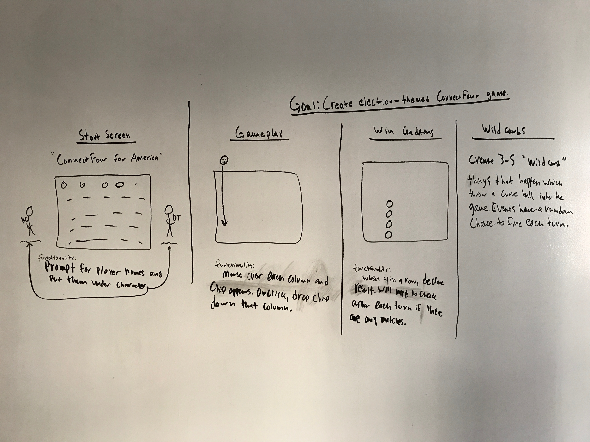

# projectOne-GA

Welcome to my game, ConnectFour for America!

Directions:
-Players enter their names and are assigned to one of two sides.

-Players then take turns dropping pieces into the board by clicking on a column at the top.

-When a column is clicked, that player's piece falls to the lowest available spot in the column.

-When a player connects four pieces, either horizontally, vertically or diagonally, that player wins!

Special thanks to the GA instructors for kicking butt and teaching me the tools to build this game.

Pseudocode vision below...

